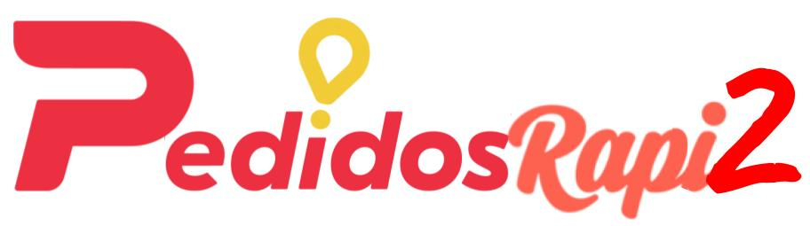

# PedidosRapi2

Una empresa con un nombre muy original nos solicita que desarrollemos su proyecto innovador en __Wollok__...

La propuesta de este negocio es la posibilidad de que los clientes realicen pedidos de distintos productos, para que alguien los lleve a su vivienda.

De cada cliente se sabe su nombre completo, dni, el historial de compras realizadas y además de que tipo es:
* __Común__: No tiene ningún beneficio asociado
* __Silver__: Sólo paga el 50% del envío. 
* __Gold__: Paga el 10% del envió y cada 5 compras que realiza, no paga el envío.

Los clientes Silver y Gold, pagan un plan mensual, plan que no vamos a modelar aún.

Lo importante, es que el cliente puede ser común y luego cambiar y elegir ser gold o silver, así como también dejar de serlo.

Un pedido, está compuesto por diversos ítems, cada uno indicando el producto y la cantidad solicitada, y el local donde fue realizado. Por ejemplo, podemos pedir media docena de empanadas a __Solo Empanatas__, 2 de carne picante, 2 de carne cuchillo y 2 de espinaca con mozzarella; son 3 productos, 2 de cada uno.

El pedido tiene un __precio bruto__ que no tiene en cuenta el envío al domicilio del cliente. Dicho precio se calcula como la sumatoria del precio de cada producto multiplicado por la cantidad solicitada.

El __precio neto del pedido__, es el que el cliente terminaría pagando. Y se calcula como: `precio bruto del pedido + valor de envío`

El valor del envío depende de la cantidad de cuadras de distancia entre el local y el cliente. Y se calcula como $15 por cuadra, pero como tope $300.

Existe un Calculador de Cuadras, que dado un cliente y un local, retorna la cantidad de cuadras de distancia (sólo se debe representar al calculador, no hace falta implementarlo, ya que dicho módulo fue comprado a otra empresa de software que realiza los cálculos de acuerdo a las orientaciones de las calles).

En este primer modelo, vamos a asumir que el precio de un producto nunca cambia, y nosotros no debemos encargarnos de actualizar el stock.

__Tip__: Leer ___todos___ los puntos antes de empezar a resolver.

Se pide:
1. Calcular sólo el precio bruto de un pedido, es decir, sin tener en cuenta el cliente.

2.  
    1. Determinar el __costo real de envío__ de un pedido para un cliente.
    2. Dado un pedido, saber cual es el __valor de envío que debe abonar__ un cliente determinado.

3. 
    1. Agregar a un pedido una cantidad de un producto. El pedido puede ya incluir el producto anteriormente, en cuyo caso sólo debe incrementarse la cantidad del ítem correspondiente.
    2. Dado un pedido, hacer que un cliente realice una compra. Una compra está compuesta por un pedido,  además el valor del envío que debe abonar y la fecha actual. Para que la compra se pueda realizar, debe pasar que el local debe tener todos los productos.

4. Conocer la compra más cara realizada por un cliente.

5. Saber el monto total ahorrado por un cliente, teniendo en cuenta lo que pagó el cliente por envíos respecto al total de costo real de envío para cada pedido.

6. Conocer, para un cliente, el producto...
    1. más caro que haya comprado (según precio unitario).
    2. de mayor cantidad comprada dentro de un mismo pedido. Es decir que si el cliente compró el mismo producto en varias compras separadas, sólo nos importa la cantidad mayor entre esas compras, no la suma.
    
    __Nota__: ¡No repetir lógica!

7. ¿Se utilizó herencia en la solución planteada?
- Respuesta “Sí”: Explicar dónde se usó __herencia__ y cuál es el beneficio de haberla usado.
- Respuesta “No”: Explicar dónde se usó __polimorfismo__ y cuál es el beneficio de haberlo usado.
